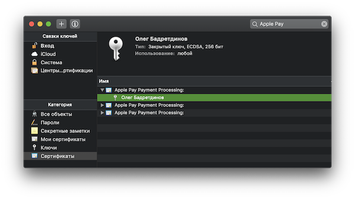

ApplePay token decryptor
========================
[Apple documentation](https://developer.apple.com/documentation/passkit/apple_pay/setting_up_apple_pay_requirements)

Token
-----
Token is a `paymentData` property from [PKPaymentToken](https://developer.apple.com/documentation/passkit/pkpaymenttoken). You could use both UTF-8 and base64 encodeding formats.

Certificates
------------
Token decryption requires certificate and a private key associated with it.

Certificates without private key will be marked with `//no private key`.

Features
--------
- [x] RSA_v1 signature verification
- [x] RSA_v1 token decryption
- [x] EC_v1 signature verification
- [x] EC_v1 token decryption
- [x] Import from keychain
- [ ] Import from PKCS#12 files